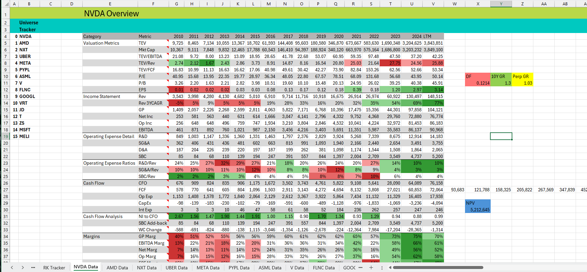

# Roaring Kitty

Roaring Kitty is a Python-based financial analysis toolkit tailored for early-stage equity research. It retrieves fundamental and market data from Nasdaq Data Link (Sharadar), structures it into clean Excel reports, and enables fast screening of public companies to identify those worth deeper analysis.

## Features

- **Stock Overview Generator**  
  Generate detailed one-pagers for individual stocks, including key financial metrics, ratios, and multi-year trends.

- **Comparison Table Creator**  
  Produce side-by-side comparisons of multiple companies across custom-defined financial metrics.

- **Comprehensive Financial Metrics**  
  Covers valuation ratios, profitability, income statements, WACC estimation, and DCF scaffolding.

- **Automated Data Integration**  
  Seamlessly pulls updated fundamentals and market prices via Nasdaq Data Link and Yahoo Finance APIs.

## Example Output



*Example of a generated stock overview for Nvidia*

## Requirements

- Python 3.13
- Sharadar Core US Equities Bundle from NDL
- Excel

## Setup

1. Clone this repository
2. Install dependencies:
   ```bash
   pip install -r requirements.txt
   ```
3. Create an `api_key.json` file with your Nasdaq Data Link API key:
   ```json
   {
     "api_key": "YOUR_API_KEY_HERE"
   }
   ```

## Project Structure

```
├── scripts/
│   ├── create_stock_overview.py    # Generate individual stock analysis
│   └── create_comparison_table.py  # Compare multiple stocks
├── src/
│   └── formatting_helpers.py       # Excel formatting utilities
├── config.json                     # Metric definitions and styling
├── available_cols.md               # Reference for available data fields
└── requirements.txt                # Python dependencies
```

## Usage

### Command-Line Interface (CLI)

You can generate reports directly from the terminal using the Python scripts provided:

#### Generate a Stock Overview
```bash
python scripts/create_stock_overview.py <path_to_excel_file> <ticker>
```

#### Generate a Comparison Table
```bash
python scripts/create_comparison_table.py <path_to_excel_file> <ticker1,ticker2,...>
```

## Available Metrics

The tool supports comprehensive financial analysis including:

- **Valuation**: Market Cap, TEV/EBITDA, P/E, P/B ratios
- **Growth**: Revenue CAGR, earnings growth trends
- **Profitability**: Gross margins, operating margins, net margins
- **Cash Flow**: Operating cash flow, free cash flow analysis
- **Capital Allocation**: Share buybacks, insider buying activity
- **Balance Sheet**: Asset quality, debt levels, working capital

See `available_cols.md` for a complete reference of available data fields.

## Notes

- **Sharadar Data Cost**: The Sharadar Core US Equities Bundle is a premium data service from Nasdaq Data Link and is not free.
- **Data Quality**: This tool relies on fundamental data from Sharadar, which while typically accurate, can occasionally contain errors.